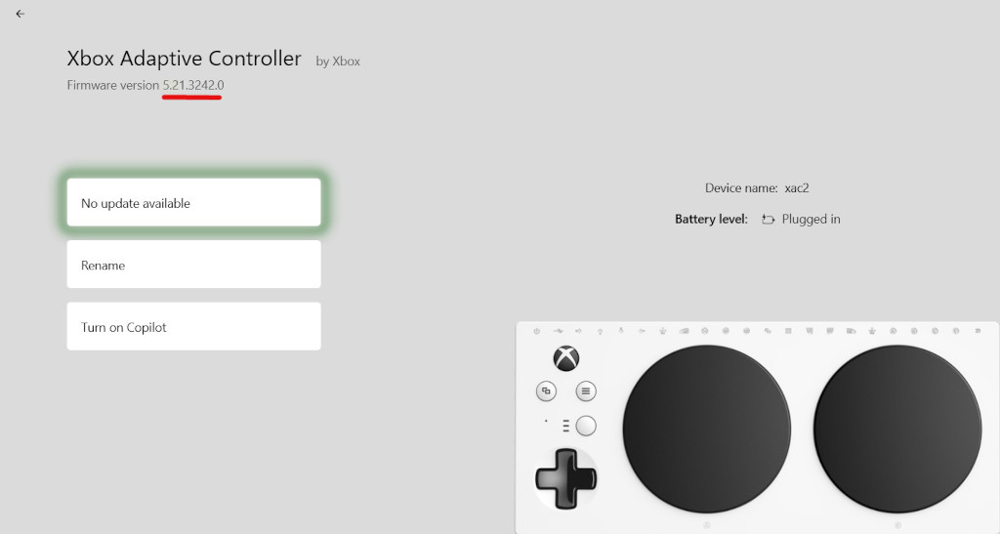
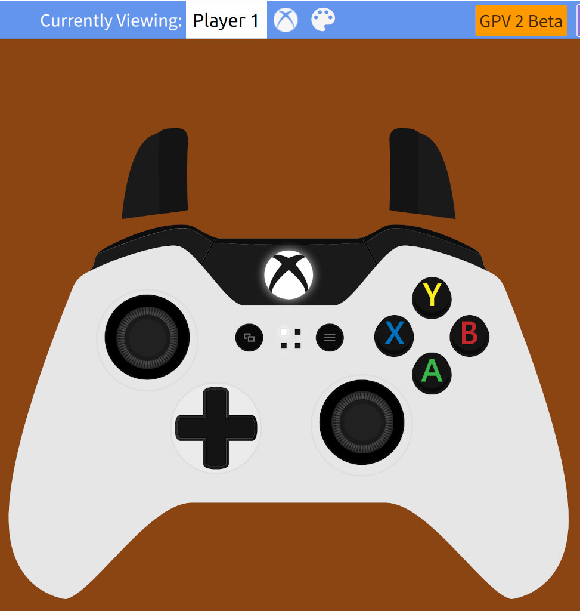

# How use a Logitech or Thrustmaster joystick as a one hand  Xbox controller

The XAC firmware 5.21.3242.0 released June 2024 can turn a Logitech
Extreme 3D Pro joystick or a Thrustmaster T.16000M into a one hand
controller. Other joysticks may work but I can only confirm this works
for the USB joysticks I have.

## New XAC firmware features:

* The joystick hat switch maps to the XAC dpad buttons. The XAC dpad buttons
  can be mapped to XAC right or left joysticks.
* 12 joystick buttons up from 8 can be mapped to XAC buttons.

1. Upgrade the XAC firmware to 5.21.3242.0. This can be done
using the Xbox Accessory app on Windows or Xbox console.

2. Plug one of the previously mentioned USB joysticks in to the left XAC USB
port. At this point, the USB joystick controls the XAC left stick. The joystick
hat switch controls the XAC dpad.

3. Use the Xbox Accessory app to remap the XAC dpad buttons to XAC
right joystick directions.

4. The front trigger button map to the XAC X1. Remap the XAC X1
button to RB (or whatever is the primary weapon button). Remap the other
buttons as desired starting with X2.

The website https://gamepadviewer.com/ is useful to confirm the
remapped buttons and sticks work as desired. For example, moving the
joystick hat switch should move the gamepad right stick. Pressing the
joystick front trigger button should press the gamepad RB button.

